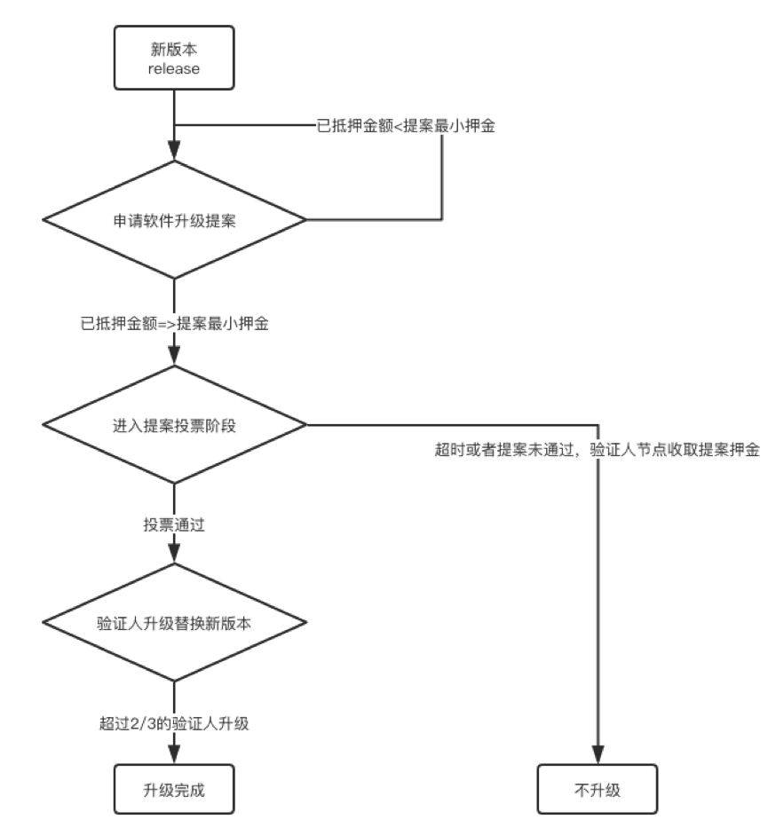

## 软件升级提案

说明：

节点升级分为两种。
一种是支持向下兼容的版本升级，称之为软分叉。
一种是不支持向下兼容的版本升级，称之为硬分叉。

该提案是针对硬分叉升级的。该过程分为下面两步：

* **通知：**提案通过后，验证者节点下载和安装指定版本软件，此时节点仍然运行之前版本软件。一旦验证者下载并安装升级软件后，向网络中发送包含对应提案proposalID的precommits表示其准备好升级。如果多个SoftwareUpgradeProposals提案在一个时段都通过，通过管道按照提案通过的顺序依次升级。
* **转换：**一旦区块中包含全网2/3的验证节点precommits，所有节点（包含验证者节点，非验证全节点，轻节点）切换到新版的软件。

